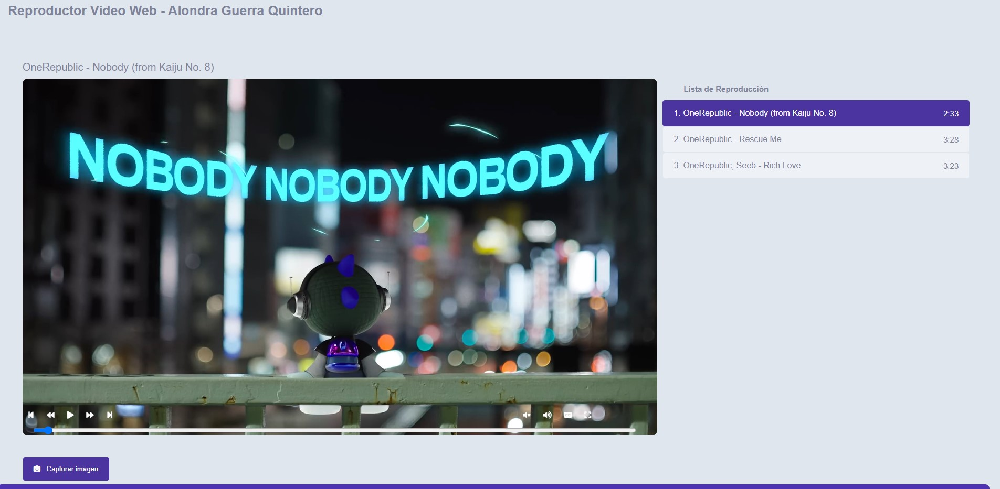

# Video Reproductor
El presente proyecto consiste en un reproductor de vídeo utilizando el estándar HTM5 a través de JavaScript y CSS. 
El reproductor tiene un diseño personalizado, independientemente del navegador web, utilizando la API de JavaScript junto con CSS para su construcción, en lugar del diseño predeterminado de la etiqueta <video> y el atributo controls.

[Proyecto Desplegado (https://plusalo.github.io/VideoWebProject/)](https://plusalo.github.io/VideoWebProject/)
## Secciones de mi sitio

## Tecnologías
* HTML
* CSS
* JS
---
Desarrollado con 💜 por [Alondra](https://github.com/PLUSAlo/VideoWebProject.git)
